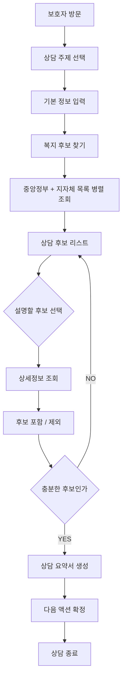
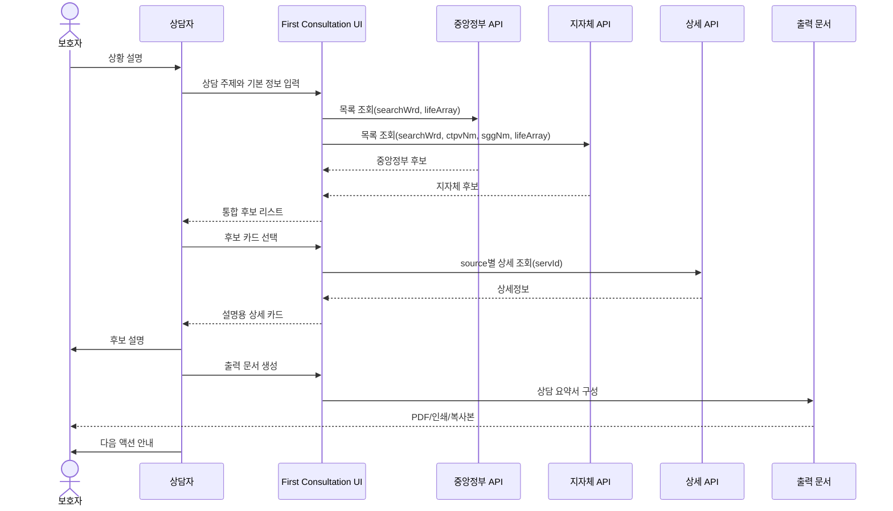

# First Consultation UX

Sprint 3 산출물  
목표: 보호자가 처음 방문했을 때 **15분 안에 상담을 마칠 수 있는 화면**을 설계한다.

코드 구현 없음.

## Product Principle

첫 상담 화면은 검색 서비스가 아니다.

보호자가 가져온 막연한 걱정을 상담자가 빠르게 구조화하고, 지금 확인해야 할 복지·케어 후보와 다음 행동을 정리해주는 상담 도구다.

15분 안에 끝나야 하므로 입력은 적고, 결과는 과하지 않아야 한다.

## 상담 목표

1. 보호자의 상황을 짧게 파악한다.
2. 고령자의 기본 조건을 입력한다.
3. 중앙정부 + 지자체 복지서비스를 동시에 조회한다.
4. 상담자가 설명하기 좋은 후보를 5~8개로 압축한다.
5. 보호자에게 줄 출력 문서를 만든다.
6. 상담 종료 시 다음 액션을 남긴다.

## 1. 상담 단계

| 단계 | 시간 | 목적 | 상담자 행동 | 시스템 행동 |
|---|---:|---|---|---|
| 0. 시작 | 0:00~0:30 | 상담 목적 선택 | 오늘 상담 주제를 고른다 | 상담 템플릿 초기화 |
| 1. 기본 정보 | 0:30~3:00 | 대상자 조건 파악 | 나이, 거주지, 동거/돌봄 상태 입력 | 지역/노년 기본 필터 준비 |
| 2. 필요 영역 | 3:00~5:00 | 상담 범위 압축 | 생활지원, 돌봄, 건강, 주거, 일자리 등 체크 | 검색 키워드와 태그 구성 |
| 3. 후보 조회 | 5:00~7:00 | 복지서비스 후보 수집 | 검색 실행 | 중앙정부/지자체 API 병렬 호출 |
| 4. 후보 정리 | 7:00~10:00 | 설명할 후보 선택 | 후보 5~8개 선택/제외 | source, tag, 지역 기준으로 정렬 |
| 5. 설명 | 10:00~13:00 | 보호자에게 후보 설명 | 카드별 핵심 설명 | 상세정보 펼침, 문의처/신청방법 표시 |
| 6. 출력 | 13:00~14:30 | 보호자 전달 자료 생성 | 출력 문서 확인 | 상담 요약, 후보 목록, 문의처 생성 |
| 7. 종료 | 14:30~15:00 | 다음 액션 확정 | 전화/방문/서류 체크 | 다음 액션 리스트 저장 또는 복사 |

## 2. 입력 정보

### 필수 입력

| 입력 | 예시 | 이유 | 저장 필요 |
|---|---|---|---|
| 상담 대상자 연령대 | 65세 이상 | 노년 필터 기본값 | NO for MVP |
| 거주 광역 | 인천광역시 | 지자체 복지 조회 | NO for MVP |
| 거주 기초 | 미추홀구 | 지자체 복지 조회 | NO for MVP |
| 상담 주제 | 돌봄, 생활지원 | 후보 태그 정렬 | NO for MVP |
| 보호자 관계 | 자녀, 배우자, 지인 | 출력 문서 표현 | NO for MVP |

### 선택 입력

| 입력 | 예시 | 이유 | 저장 필요 |
|---|---|---|---|
| 가구 상황 | 독거, 부부, 가족동거 | 후보 설명 보조 | NO for MVP |
| 건강/돌봄 상태 | 거동 불편, 치매 의심 | 장기요양/보건소 안내 보조 | NO for MVP |
| 경제 상황 | 기초생활, 차상위, 모름 | 저소득 태그 후보 우선 | NO for MVP |
| 긴급 여부 | 오늘 필요, 이번 주, 여유 있음 | 긴급/안전 후보 우선 | NO for MVP |
| 이미 이용 중인 서비스 | 노인맞춤돌봄 등 | 중복 설명 방지 | NO for MVP |

### 입력 원칙

- 주민등록번호 입력 없음.
- 건강보험 자격 조회 없음.
- 장기요양등급 조회 없음.
- 수급 가능성 판정 없음.
- 모르면 `모름`으로 진행 가능.

## 3. 화면 전환

### Screen A. 상담 시작

목적: 상담자가 30초 안에 오늘 상담 범위를 잡는다.

```text
┌──────────────────────────────────────────────┐
│ Pigbar Welfare                               │
│ 첫 상담                                      │
│                                              │
│ 오늘 어떤 상담인가요?                        │
│ [생활지원] [돌봄] [건강] [주거] [일자리]     │
│ [요금감면] [긴급위기] [전체]                 │
│                                              │
│ [상담 시작]                                  │
└──────────────────────────────────────────────┘
```

### Screen B. 기본 정보 입력

목적: API 조회에 필요한 최소 조건만 입력한다.

```text
┌──────────────────────────────────────────────┐
│ 대상자 기본 정보                              │
│                                              │
│ 연령대       [65세 이상 ▼]                   │
│ 광역         [인천광역시]                    │
│ 기초         [미추홀구]                      │
│ 가구상황     [모름 ▼]                        │
│ 건강/돌봄    [모름 ▼]                        │
│ 경제상황     [모름 ▼]                        │
│                                              │
│ ☑ 노년 대상만 보기                           │
│                                              │
│ [복지 후보 찾기]                             │
└──────────────────────────────────────────────┘
```

### Screen C. 후보 조회 중

목적: 상담 흐름이 끊기지 않게 짧은 상태만 보여준다.

```text
┌──────────────────────────────────────────────┐
│ 복지 후보를 찾고 있습니다                     │
│                                              │
│ ✓ 중앙정부 복지서비스 조회                    │
│ ✓ 지자체 복지서비스 조회                      │
│ ○ 상담 태그 정리                              │
│ ○ 후보 카드 생성                              │
└──────────────────────────────────────────────┘
```

### Screen D. 상담 후보 리스트

목적: 검색 결과를 목록이 아니라 상담 후보로 보여준다.

```text
┌──────────────────────────────────────────────┐
│ 상담 후보 8개                                │
│ 인천광역시 미추홀구 · 노년 대상               │
│                                              │
│ [중앙정부] 노인맞춤돌봄서비스                 │
│ 보호·돌봄 · 노년 · 생활지원                  │
│ 돌봄이 필요한 어르신에게 방문/안전 확인...    │
│ [설명 보기] [후보에 포함 ✓]                   │
│                                              │
│ [지자체] 어르신 돌봄 지원                     │
│ 보호·돌봄 · 지자체                           │
│ 지역 어르신 돌봄 서비스를 지원합니다...       │
│ [설명 보기] [후보에 포함 ✓]                   │
│                                              │
│ 제외된 후보 보기                              │
└──────────────────────────────────────────────┘
```

### Screen E. 상세 설명

목적: 보호자에게 말할 수 있는 항목만 구조화한다.

```text
┌──────────────────────────────────────────────┐
│ 노인맞춤돌봄서비스                            │
│ [중앙정부] [보호·돌봄] [노년]                 │
│                                              │
│ 무엇을 지원하나                               │
│ - 안전 확인, 생활교육, 서비스 연계             │
│                                              │
│ 누가 확인해볼 수 있나                         │
│ - 돌봄이 필요한 노년층                         │
│                                              │
│ 어디에 문의하나                               │
│ - 보건복지상담센터 129                        │
│                                              │
│ 신청/확인 방법                                │
│ - 읍면동 주민센터 문의                         │
│                                              │
│ [출력 문서에 포함] [목록으로]                 │
└──────────────────────────────────────────────┘
```

### Screen F. 상담 요약 / 출력

목적: 1장짜리 보호자 전달 자료를 만든다.

```text
┌──────────────────────────────────────────────┐
│ 상담 요약                                    │
│                                              │
│ 오늘 확인한 방향                             │
│ - 돌봄과 생활지원 서비스를 먼저 확인합니다.   │
│ - 지자체 서비스는 미추홀구 기준으로 봅니다.   │
│                                              │
│ 우선 확인할 서비스                            │
│ 1. 노인맞춤돌봄서비스                         │
│ 2. 장애인 건강검진기관 지원                   │
│ 3. 지자체 어르신 돌봄 지원                    │
│                                              │
│ 다음 액션                                    │
│ □ 129 전화                                   │
│ □ 주민센터 문의                              │
│ □ 장기요양기관 정보 확인                      │
│                                              │
│ [PDF 저장] [복사] [상담 종료]                │
└──────────────────────────────────────────────┘
```

## 4. API 호출 시점

| 시점 | 호출 | 파라미터 | 이유 |
|---|---|---|---|
| Screen B에서 `복지 후보 찾기` 클릭 | 중앙정부 목록 API | `searchWrd`, `lifeArray=006` optional | 전국 단위 제도 후보 조회 |
| Screen B에서 `복지 후보 찾기` 클릭 | 지자체 목록 API | `searchWrd`, `ctpvNm`, `sggNm`, `lifeArray=006` optional | 지역 단위 제도 후보 조회 |
| 후보 카드 `설명 보기` 클릭 | source별 상세 API | `servId` | 상세 대상/신청방법/문의처 조회 |
| 출력 문서 생성 직전 | 호출 없음 | 현재 선택된 후보 사용 | 상담 시간 절약 |

### 호출 원칙

- 검색 버튼 한 번으로 중앙정부 + 지자체 병렬 호출.
- 상세조회는 사용자가 열어본 카드만 호출.
- 개인 인증 API 호출 없음.
- DB 저장 없음.
- 추천/수급 판정 API 없음.

## 5. 추천 결과

여기서 추천은 AI 판정이 아니다.

상담자가 설명하기 좋게 정리한 **후보 정렬**이다.

### 후보 정렬 기준

1. 사용자가 선택한 상담 주제와 태그가 맞는가.
2. 노년 대상 서비스인가.
3. 지자체 결과가 현재 거주지와 맞는가.
4. 신청방법/문의처가 있는가.
5. 요약이 보호자에게 설명 가능한가.

### 결과 그룹

| 그룹 | 의미 | 예시 |
|---|---|---|
| 우선 설명 | 상담자가 바로 설명할 후보 | 노인맞춤돌봄, 지역 돌봄 지원 |
| 추가 확인 | 조건 확인이 필요한 후보 | 소득/장애/가구 조건 포함 서비스 |
| 기관 연결 | 제도보다 문의처가 중요한 후보 | 장기요양기관, 치매안심센터 |
| 제외 | 상담 주제와 맞지 않는 후보 | 청년/아동/임산부 서비스 |

### 금지 표현

- 받을 수 있습니다.
- 수급 가능합니다.
- 신청하면 됩니다.
- 해당됩니다.
- 자격이 됩니다.

### 권장 표현

- 확인해볼 수 있습니다.
- 문의 후보로 남깁니다.
- 주민센터에 조건 확인이 필요합니다.
- 보호자에게 먼저 설명할 만한 후보입니다.

## 6. 출력 문서

### 출력 문서 이름

`첫 상담 요약서`

### 포함 항목

| 항목 | 내용 |
|---|---|
| 상담 일시 | 출력 시점 |
| 대상자 조건 | 연령대, 지역, 주요 상담 주제 |
| 우선 확인 서비스 | 3~5개 |
| 추가 확인 서비스 | 0~5개 |
| 문의처 | 129, 주민센터, 기관 연락처 |
| 신청 전 확인할 것 | 소득, 가구, 건강/돌봄 상태 등 |
| 다음 액션 | 전화, 방문, 서류 준비, 재상담 |
| 유의문 | 최종 자격은 담당기관 확인 필요 |

### 출력 문서 Mockup

```text
첫 상담 요약서

대상자
- 65세 이상
- 인천광역시 미추홀구
- 상담 주제: 돌봄, 생활지원

오늘 먼저 확인할 서비스
1. 노인맞춤돌봄서비스
   문의: 129 또는 주민센터
   확인: 돌봄 필요 상태, 이용 가능 지역

2. 지자체 어르신 돌봄 지원
   문의: 미추홀구 / 주민센터
   확인: 지역 조건, 서비스 제공 여부

추가 확인
- 장기요양기관 정보
- 치매안심센터 상담

다음 액션
□ 129 전화
□ 주민센터 문의
□ 필요 서류 확인

유의
이 문서는 상담용 정리 자료입니다.
최종 대상 여부와 신청 가능 여부는 담당기관 확인이 필요합니다.
```

## 7. 상담 종료

상담 종료는 단순 종료가 아니라 다음 행동을 확정하는 단계다.

### 종료 체크리스트

| 체크 | 항목 |
|---|---|
| □ | 보호자에게 우선 확인 후보 3개 이하로 설명했는가 |
| □ | 문의처가 있는 후보만 남겼는가 |
| □ | 최종 자격 판정이 아님을 안내했는가 |
| □ | 다음 연락/방문 장소를 정했는가 |
| □ | 출력 문서를 전달했는가 |

### 종료 화면

```text
┌──────────────────────────────────────────────┐
│ 상담 종료                                    │
│                                              │
│ 오늘 남긴 다음 액션                          │
│ ✓ 129 전화                                   │
│ ✓ 주민센터 문의                              │
│ ✓ 장기요양기관 정보 확인                      │
│                                              │
│ [새 상담 시작] [요약서 다시 보기]            │
└──────────────────────────────────────────────┘
```

## 8. 다음 액션

### 보호자 액션

| 액션 | 설명 |
|---|---|
| 129 전화 | 중앙정부 서비스 확인 |
| 주민센터 문의 | 지자체 서비스 및 신청 조건 확인 |
| 장기요양기관 확인 | 돌봄/요양 서비스 연결 가능성 확인 |
| 치매안심센터 문의 | 치매/인지 관련 상담 필요 시 |
| 서류 준비 | 신분증, 가족관계, 소득 관련 자료 등 |

### 상담자 액션

| 액션 | 설명 |
|---|---|
| 후보 제외 사유 기록 | 같은 후보 반복 설명 방지 |
| 다음 상담 예약 | 보호자가 추가 자료를 가져오는 경우 |
| 기관 연결 | 전화번호/주소를 보호자에게 전달 |
| 출력 문서 전달 | PDF 또는 인쇄 |

## User Flow



## Sequence Diagram



## UI Mockup: 15-Minute Layout

```text
┌────────────────────────────────────────────────────────────────────┐
│ First Consultation                         00:07 / 15:00           │
├───────────────────────┬────────────────────────────────────────────┤
│ 입력                  │ 상담 후보                                  │
│                       │                                            │
│ 지역                  │ [중앙정부] 노인맞춤돌봄서비스              │
│ 인천광역시            │ 보호·돌봄 · 노년 · 생활지원               │
│ 미추홀구              │ [설명 보기] [포함]                         │
│                       │                                            │
│ 대상                  │ [지자체] 어르신 돌봄 지원                  │
│ ☑ 노년 대상           │ 보호·돌봄 · 지자체                         │
│                       │ [설명 보기] [포함]                         │
│ 주제                  │                                            │
│ ☑ 돌봄                │ [중앙정부] 에너지바우처                    │
│ ☑ 생활지원            │ 에너지 · 저소득                            │
│ ☐ 일자리              │ [설명 보기] [보류]                         │
│                       │                                            │
│ [복지 후보 찾기]      │                                            │
├───────────────────────┴────────────────────────────────────────────┤
│ 선택 후보 3개 · 추가 확인 2개 · 제외 6개                           │
│ [상담 요약서 만들기]                                                │
└────────────────────────────────────────────────────────────────────┘
```

## MVP Screen List

| Screen | 필수 여부 | 설명 |
|---|---|---|
| 상담 시작 | YES | 상담 주제 선택 |
| 기본 정보 입력 | YES | 지역/연령/상황 입력 |
| 조회 중 | YES | API 호출 상태 |
| 후보 리스트 | YES | 중앙정부 + 지자체 통합 결과 |
| 상세 카드 | YES | 후보 설명 |
| 출력 문서 | YES | 보호자 전달 자료 |
| 상담 종료 | YES | 다음 액션 확정 |
| 상담 기록 저장 | NO | MVP에서는 저장하지 않음 |
| 로그인 | NO | MVP에서는 사용하지 않음 |
| 개인 자격 조회 | NO | 법적/인증 검토 전 제외 |

## MVP Success Criteria

| 기준 | 목표 |
|---|---|
| 첫 입력 완료 | 3분 이내 |
| 후보 조회 | 2분 이내 |
| 후보 설명 | 6분 이내 |
| 출력 문서 생성 | 2분 이내 |
| 다음 액션 확정 | 2분 이내 |
| 전체 상담 | 15분 이내 |

## Open Decisions

| 결정할 것 | 옵션 |
|---|---|
| 후보 기본 개수 | 5개 / 8개 / 10개 |
| 출력 문서 형식 | PDF / 인쇄 / 클립보드 복사 |
| 장기요양기관 연결 | Sprint 3 포함 / Sprint 4 분리 |
| 상담 기록 저장 | 미저장 / 로컬 임시 / DB 저장 |
| 보호자용 문장 톤 | 행정형 / 상담형 / 체크리스트형 |

## Non-Goals

- AI 수급 판정
- 로그인
- CRM
- DB 저장
- 개인정보 기반 자동 조회
- 장기요양등급 조회
- 신청 자동화
- 기관 추천 순위 단정
